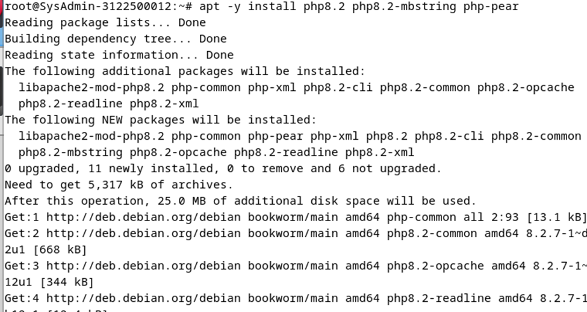
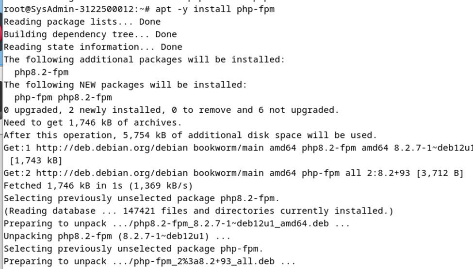
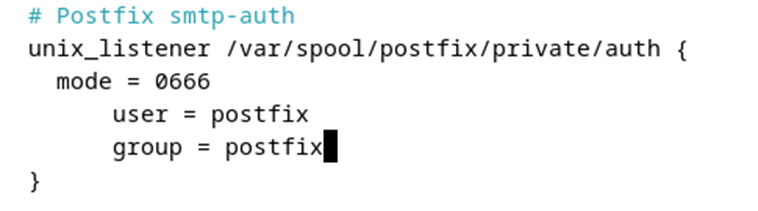

Instalasi paket layanan sinkronisasi waktu di dalam root. Sistem saya sudah terinstalasi dengan paket terbaru.
 

Konfigurasi timezone ke Asia/Jakarta
 

Konfigurasi Real Time Clock untuk merefer ke UCT 
 

Aktifkan NTP Client untuk sinkronsasi waktu
 

Sunting file timesyncd.conf untuk mengarahkan ke NTP untuk mendapatkan waktu delay terpendek
 
 
 
NTP Client
Restart dan pastikan layanan sinkronisasi 

 

Pengecekan kesesuaian tanggal system dengan perintah
 

Apache 2 + PHP-FM
Install Apache2
 
 

Konfigurasi apache2
  
 
 
 
 
 

 
 
  
Test web Browser
 

Install PHP 8.2
  
 
 

Install PHP-FM
 
Konfigurasi PHP-FM
 
 
 
 
Test validasi
 
Test browser
 
Database System: MariaDB
Instalasi maria DB 10.11
 
 
 
 
Inisial konfigurasi dan testing database
 
 
 
 
 
  
 
 

Email System
POSTFIX : SMTP Server (TCP 25)
 
 
 
 
 
 
 
 
 
 
 
 
 
 
 
 
 
 
  

Menambahkan konfigurasi anti spam
 
 
 
DOVECOT : IMAP4 (TCP143) and POP3 (TCP 110) Server
Instalasi dovecot server
 
 
 
  
 
 
 
 
 
 
 
Final CHECK semua SERVICES
  
Cek layanan Posfix

debian evolution

Roundcube
 

 
	
