Setting DHCP
1. Buka DHCP
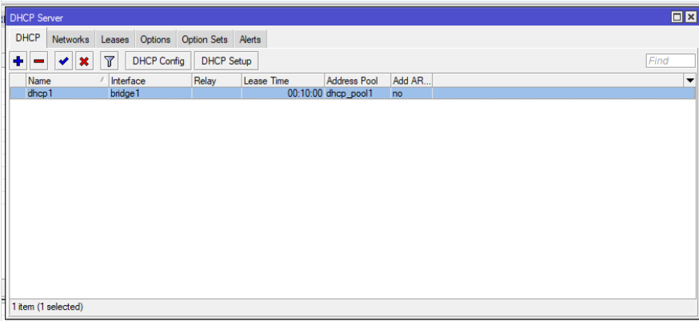

2. Pilih bridge1
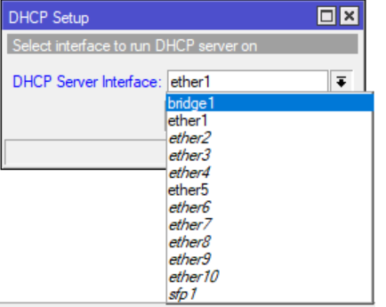

3. Masukkan Address Space
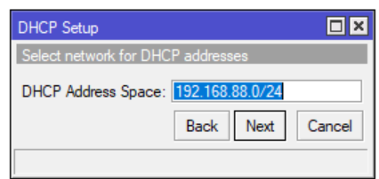

4. Masukkan gateway 
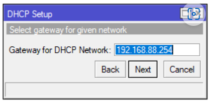

5. Masukkan addresses to give out
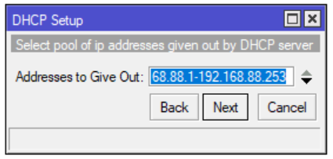

6. Masukkan DNS server
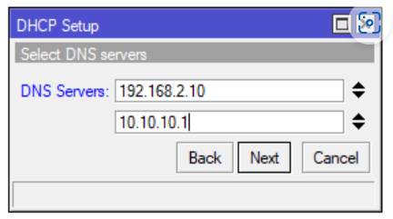

7. Masukkan lease time
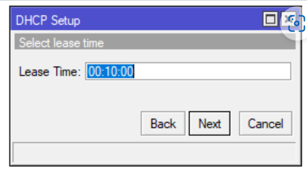

8. Cek Koneksi
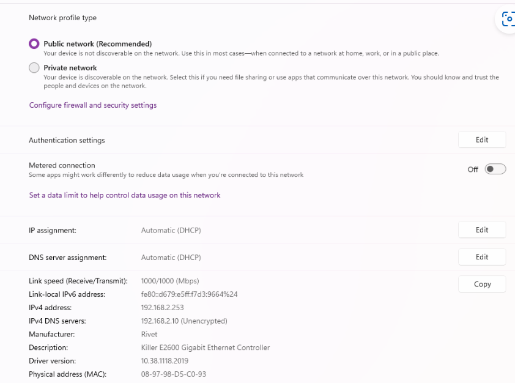

9. Ubah adapter 1
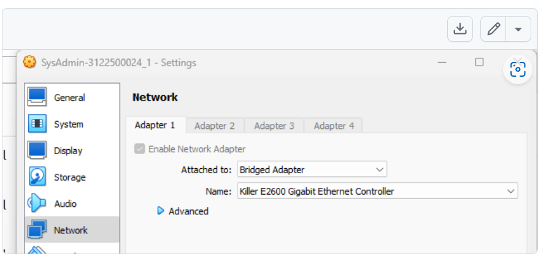

Percobaan
10. Ping kelompok lain
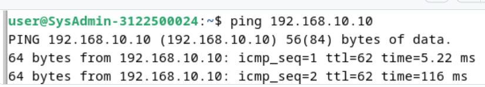

11. Ubah forwarders, allow-transfer, allow-query, allow-recursion, dan listen-on.
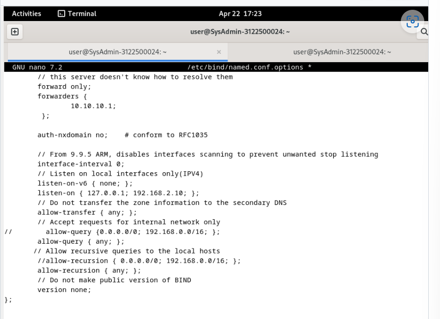

12. Ubah nameserver menjadi 192.168.2.10 di resolv.conf 
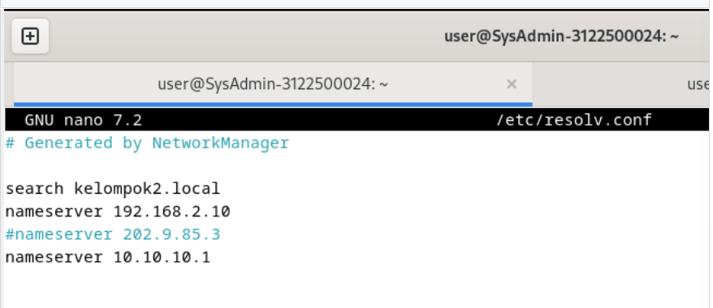

13. Ubah connection menjadi static
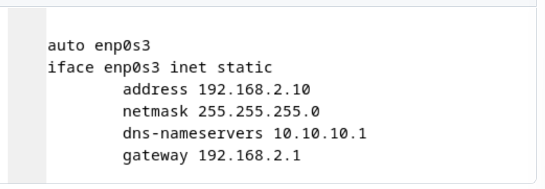

14. Jalankan perintah /var/lib/bind$ nslookup -q=MX kelompok2.local
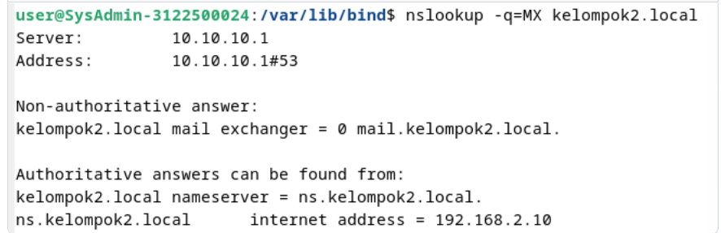

15. Tes kirim dan receive email ke kelompok lain
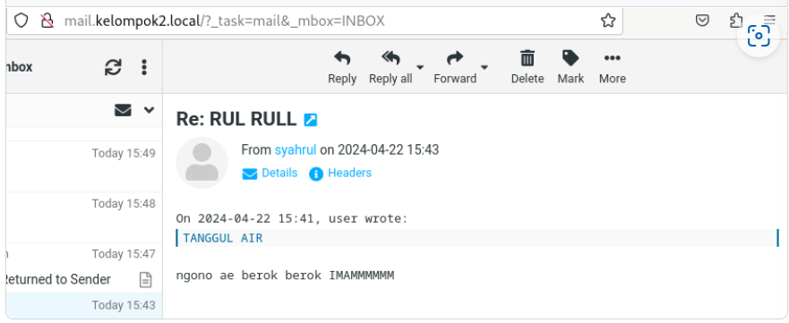

16. Ping 1.1.1.1
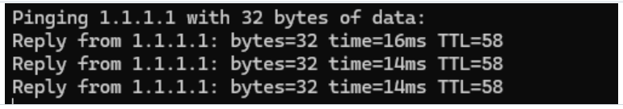