1. lakukan instalasi bind9

2. cek instalasi di /etc/bind
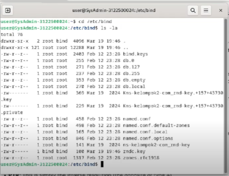
3. cek konfigurasi utama bind di named.conf.
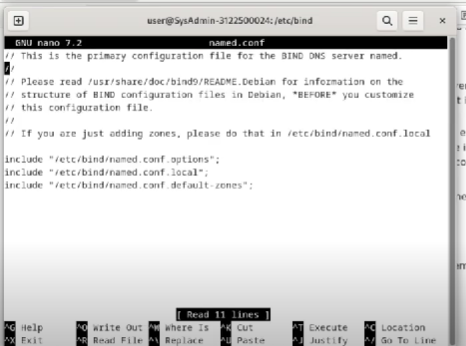
4. Menambahkan ACL (access list), control, dan include 3 file.
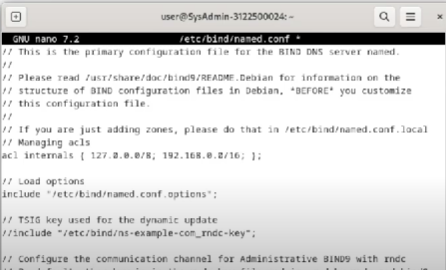
5. Buka named.conf.deafult-zones.
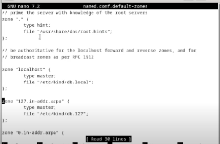
6. Buka named.conf.option, mengisi provider dan listen-on. Listen ditambahkan sesuai kelompok masing-masing
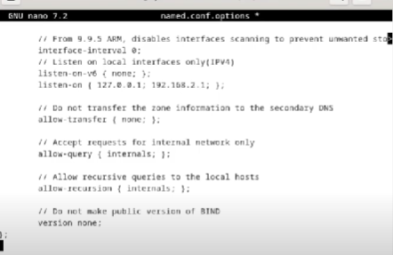
7. Buka named.conf.local, untuk mengset atau konfigurasi zone file. Melakukan pengubahan zone sesuai nama kelompok.
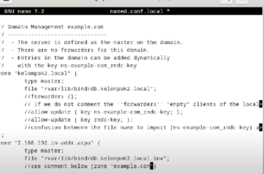
8. Lakukan sudo named-checkconf untuk mengeck pesan error. jika tidak ada pesan error yang keluar itu berarti konfigurasi yang dilakukan telah benar.
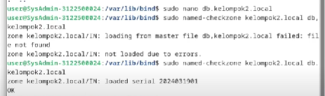
9. Pergi ke arah configuration zone file. 

10. Masuk ke zone file pertama dan mengubah data di dalamnya.
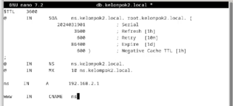
11. Masuk ke zone file kedua (.inv) untuk mengubah data seperti file sebelumnya.
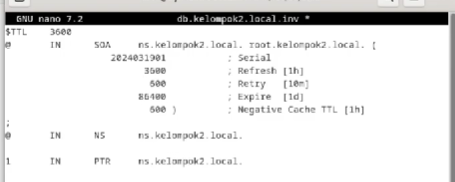
12. Jalankan sudo systemctl restart named untuk menjalankan sistem bind.
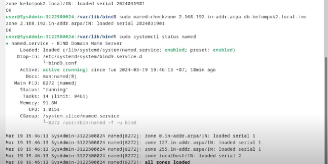
13. Cek status bind apakah running atau tidak.
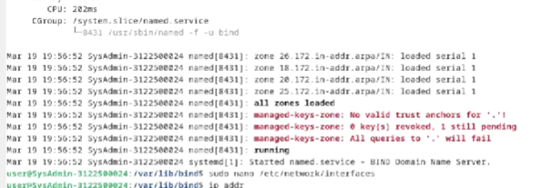
14. Cek apakah port terbuka atau tidak.
15. Gunakan perintah dig.
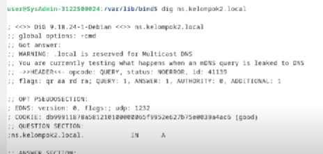
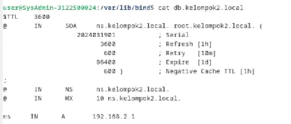
16. Gunakan perintah nslookup.
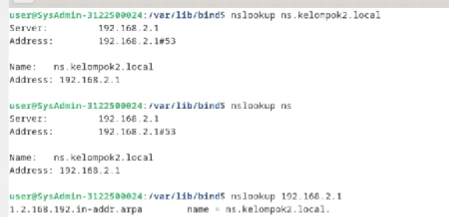
