# **Kelompok 1**

*System Administrator*

**3122500024** Muhamad Reza Muktasib
**3122500012** Awal Raya
**3122500011** Ali Azhar P.B

---

# Software Sources

Package yang ada pada sistem operasi kita (DEBIAN) didapatkan dari sumber link repository yang berada pada __/etc/apt/sources.list__

```markdown
# Cara Membuka dan Mengedit File SourceList

apt edit-sources

# Atau menggunakan text-editor nano

nano /etc/apt/sources.list
```

---
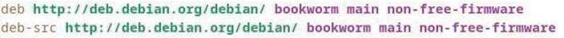
Beberapa istilah yang ada di dalam file ``sources.list``

| Istilah  | Deskripsi |
|----------:|:-------------|
|``deb``| wujud paket berupa biner |
|``deb-src``| wujud paket berupa source code|
|``http:..https:``| alamat internet dari server repo|
|``bookworm``| cabang struktur repository|
|``main non-free``| bagian dari repository|

---

> ### Kenapa `Bookworm` bukan `stable`
 Bookworm adalah versi debian sekarang, dan stable bermakna bahwa versi sekarang stabil. sehingga kita dapat membedakan versi dari kernel jika terdapat pembaruan. contoh ``Debian 13 Trixie`` rilis maka ``Bookworm`` menjadi ``oldstable`` dan sekarang berganti ke ``Trixie``.


---

#### Repository, Branches, Sections/Component

software package pada debian di letakan di dalam repository yang dimana dibagi menjadi ``2 bagian``, __cabang(_branch_)__ dan __komponen(_section_)__

---

# Cabang ( Branchs )

aktif: ``stable (stabil)``, ``testing (pengujian)`` dan ``unstable (tidak stabil)``.

|Jenis |Deskripsi|
|----|:-----|
|``stable``| Rilis distribusi resmi terbaru dari Debain.|
|``testing``| Berisi _package_ yang belum ada di stable, tapi dalam antrian untuk rilis stabil.|
|``unstable``| Merupakan versi dimana terjadi pengembangan aktif terhadap Debian.|

---

# Komponen ( Section )

| Komponen         | Keterangan                                          |
|:--------------------|:-----------------------------------------------------|
| ``main   ``            | Mematuhi __DFSG__ tanpa adanya ketergantungan "non-free" |
| ``non-free-firmware`` | Firmware non-free disertakan secara default sejak Debian 12 |
| ``contrib ``           | Mematuhi __DFSG__ dengan beberapa ketergantungan "non-free" |
| ``non-free``           | Tidak mematuhi __DFSG__                                   |

---

### Apa itu DFSG?

DFSG adalah panduan filosofis Debian untuk perangkat lunak bebas.
di main sendiri seluruhnya 100% gratis. sementara bagian contrib, non-free, dan non-free-firmware dapat mengandung software sebagian atau sepenuhnya non-free yang mungkin diperlukan untuk fungsi hardware tertentu (driver) contoh **NVIDIA**.

---

##### Backport Packages

<style>
    p, li {
        font-size: 30px;
    }
</style>
debian memberikan sebuah repo spesial bernama baacports yang dimana berisi lebih banyak versi dari aplikasi sebelumnya, repo ini secara default tidak aktif tetapi secara default regular repo yang menjadi prioritas tingggi

##### Apa itu Backport?

Backport adalah mekanisme yang memungkinkan aplikasi yang saat ini disimpan di repositori development Debian, untuk di-porting kembali ke versi “stabil”.


---
## Cara: memodifikasi repository


memodifikasi software sources dari sistem kita  ke dalam 	kontrib atau non free harus siap dengan beberapa dampak seperti 
kurangnya kebebasan untuk paket semacam ini
1. kurangnya dukungan dari proyek Debian (Anda tidak dapat memelihara perangkat lunak tanpa memiliki kode sumbernya)
kontaminasi sistem Debian Anda yang sepenuhnya gratis.
2. hal ini seperti membunuh pink rabbits
dilansir dari sourceforge Pink Rabbit Linux is a Linux Distribution which facilitates making your own Linux Distribution.

---

```markdown
# jalankan

apt edit-sources
```

Contoh Pengisian free packages

```deb http://deb.debian.ofg/debian/ bookwofm main```

Contoh Pengisian free packages dan tipe lain

```deb http://deb.debian.org/debian/ bookworm main contrib non-free non-free-firmware```


---

# APT (Advanced Package Tool) di Terimnal

User, Administrator

---

### Command apt untuk USER

|Command | Description |
|--------|:------------|
|``apt show foo``| Menampilkan informasi paket foo|
|``apt search foo``| Mencari paket bernama/berkaitan foo|
|``apt-cache policy foo``| Menampilkan versi tersedia paket foo|

---
### Command apt untuk ADMINISTRATOR
<style>
    table {
        font-size: 30px;
    }
</style>
__Pastikan__ menggunakan ``sudo`` untuk menjalankan perintah berikut (root)

|Command | Description |
|--------|:------------|
|``apt update``| Update repository metadata (list versi dll)|
|``apt install foo``| Memasang paket foo dan yang terkait|
|``apt upgrade``| Menghapus versi lama paket|
|``apt full-upgrade``| Mengupdate/hapus paket yang beneran terbaru|
|``apt remove foo``| menghapus paket foo, tidak confignya|
---

|Command | Description |
|--------|:------------|
|``apt autoremove``| auto menghapus paket tidak dibutuhkan|
|``apt purge foo``| Menghapus paket foo dengan confignya|
|``apt clean``| Menghapus cache lokal paket yang terinstall|
|``apt autoclean``| Menghapus cache lokal paket yang lama(usang)|
|``apt-mark showmanual``| tandai paket sebagai "manual install"|

contoh all in one command
```apt update && apt full-upgrade && apt autoclean```

menghapus paket usang
```apt autoremove --purge```

---

##### Versi Mudah install Paket dengan Aplikasi _Software_

langkah Install: **Buka, Cari, Klik Tombol Install**

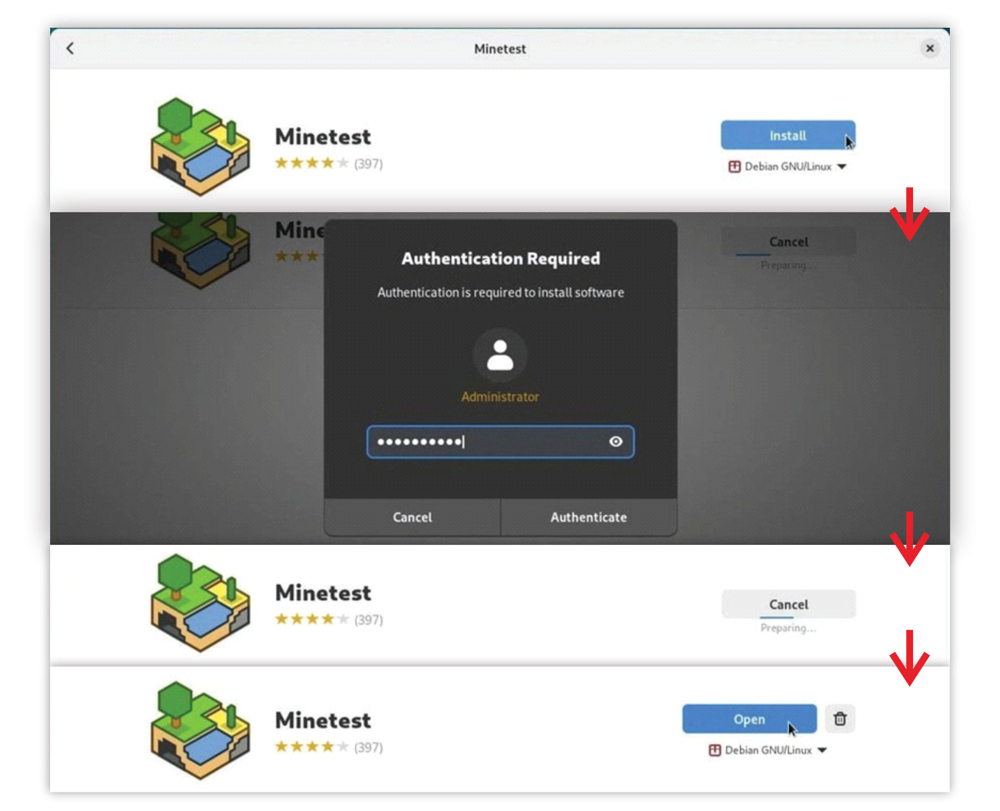

---
langkah Delete: **Klik Bagian Installed, Klik Uninstall, Confirm, Done**

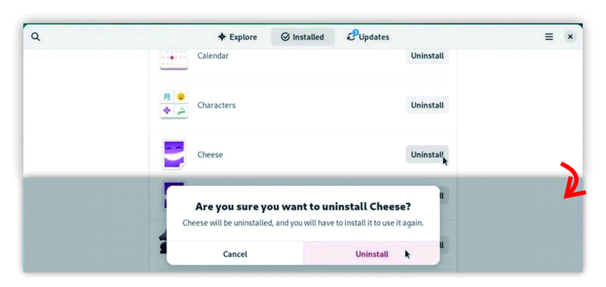

---
langkah upgrade: **Bagian Update, Klik Download, Klik Restart and Update**

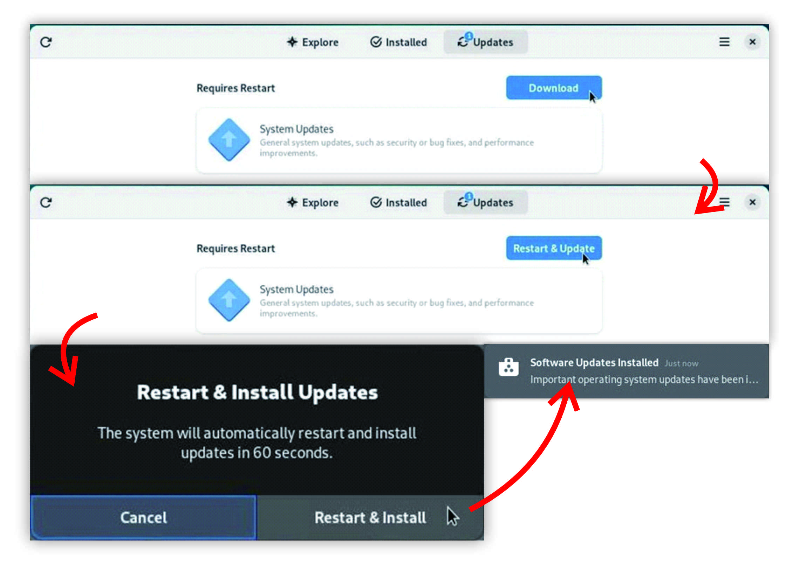

---
langkah modifikasi source repo: **Klik Hamburger menu di kanan atas, Klik Software Repositories, Konfigurasi, Klik Reload.**

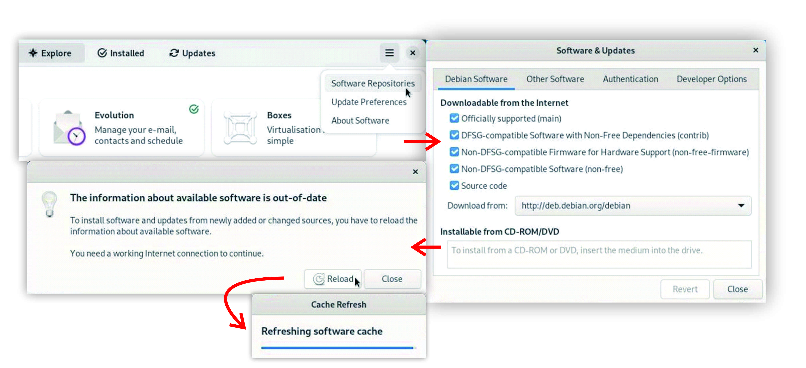

---
##### Versi Mudah install Paket dengan Aplikasi _KDE_

langkah Install: **buka aplikasi, klik tombol Install**

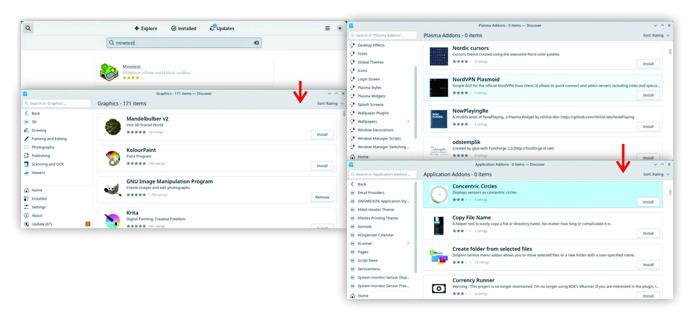

---

langkah Delete: **Klik bagian installed, klik tombol Remove**

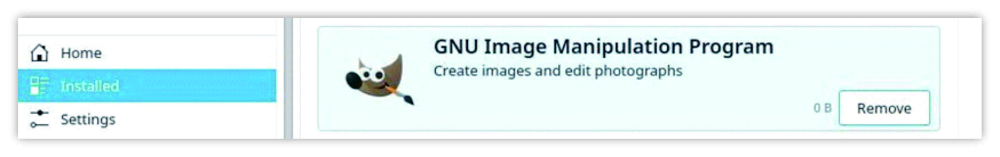


---
langkah Update: **Klik bagian Update, klik tombol Update All, Isi Password**    

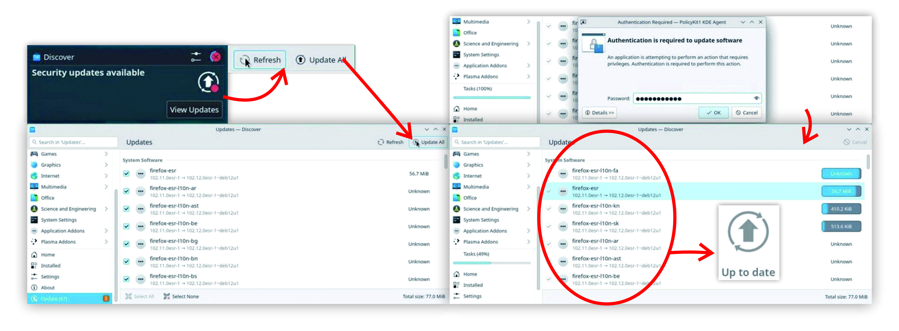

---
langkah Mengganti Repo: **klik bagian settings centang Repo Yang Dipilih**    

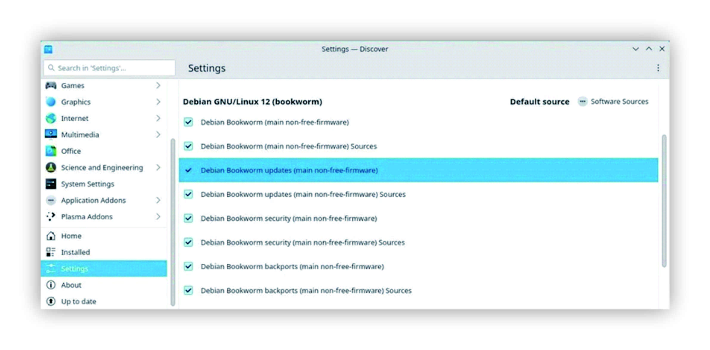

---
##### Versi Mudah install Paket dengan Aplikasi _Synaptic_

pastikan reload sebelum menggunakan aplikasi.

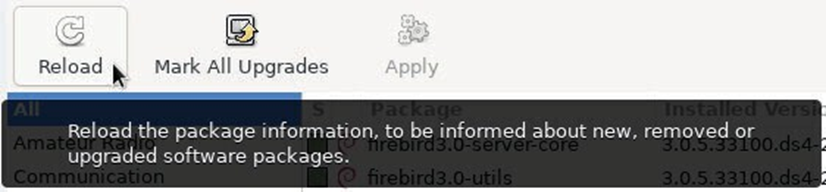

---
langkah Update: **Klik mark all Upgrades, kemudian tekan Mark, setelah itu tekan Apply**  

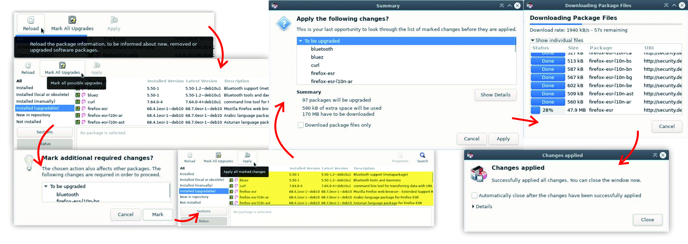

---
langkah Update: **Cari App, Kemudian klik kanan, Mark for Install, Apply**    
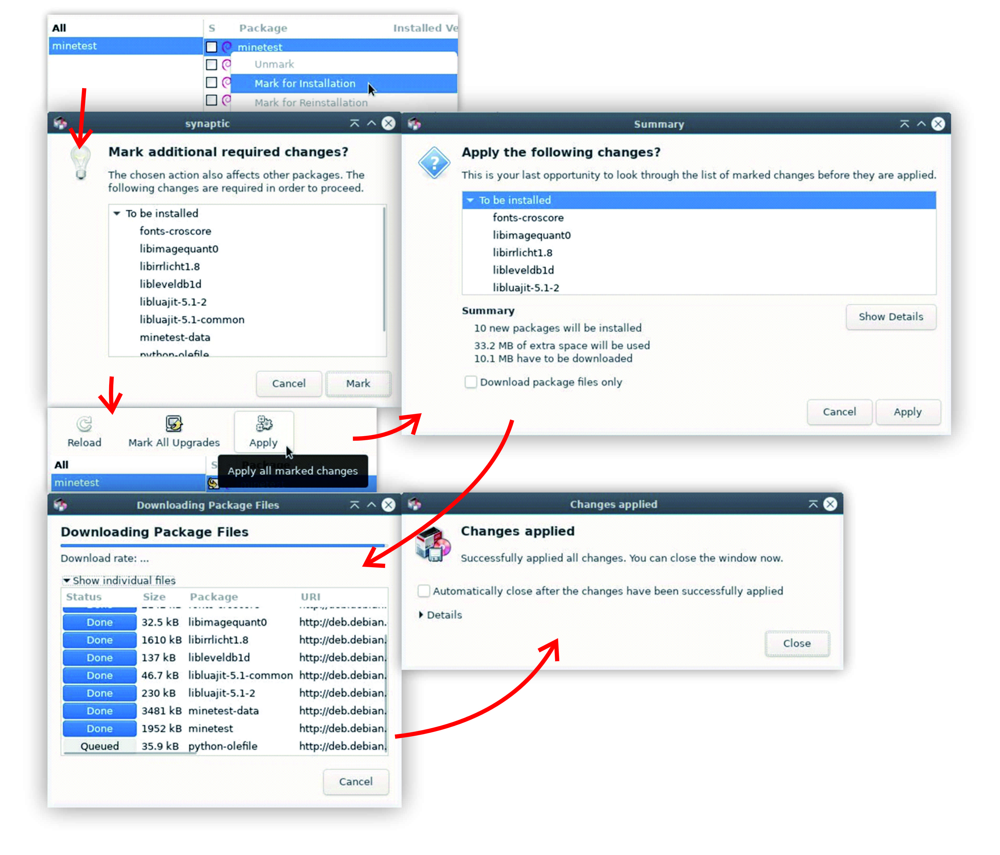

---
langkah Delete: **pilih bagian installed, Kemudian klik kanan, Mark for Complete Removal, Apply**    

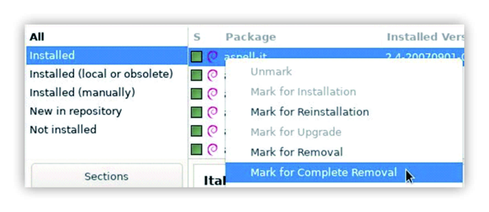

---
langkah Delete File Tidak Terpakai: **pilih bagian installed auto removable, Kemudian klik kanan, Mark for Complete Removal, Apply**    

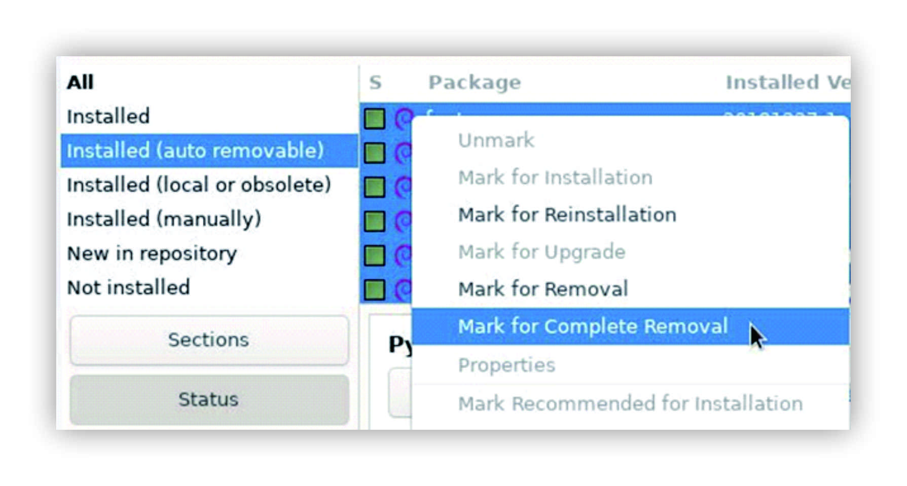

---
langkah Delete File Config Sisa: **pilih bagian installed residual config, Kemudian klik kanan, Mark for Complete Removal, Apply**    

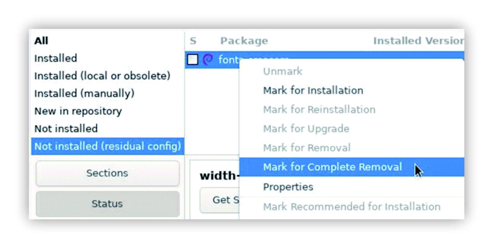

---

Synaptic Preferences

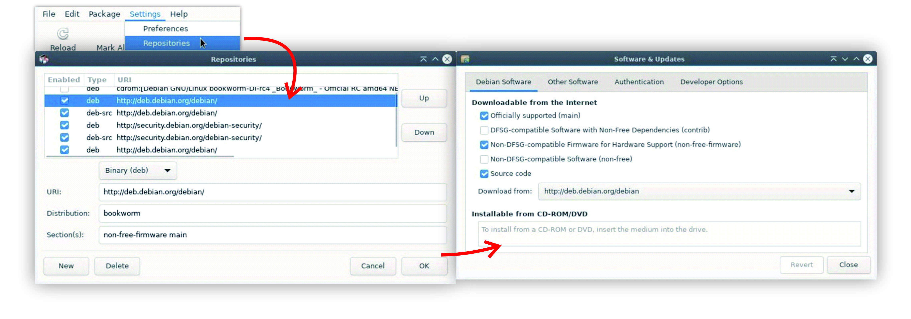

---

# Membersihkan System
cara membersihkan ruang disk yang penuh terdapat beberapa **Tool** yang dapat digunakan sebelum itu mari kita gunakan terminal

```
df -h
```

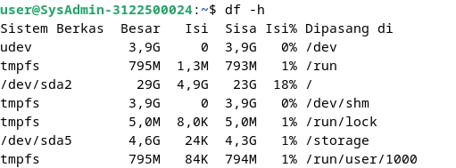

---

melihat direktori secara banyak dan terurut

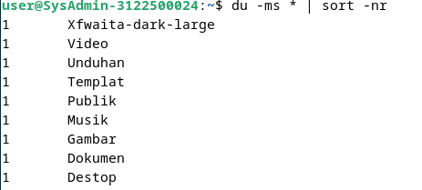

---

Menggunakan **Tool ncdu**
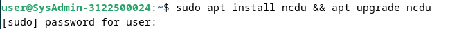

hasil ``ncdu``

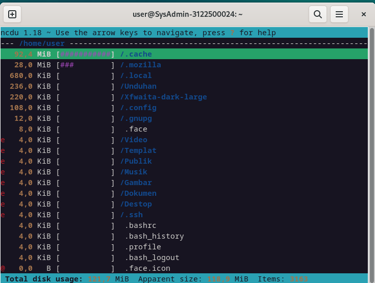


---

Tool **Baobab** secara default telah diinstall bersama Gnome

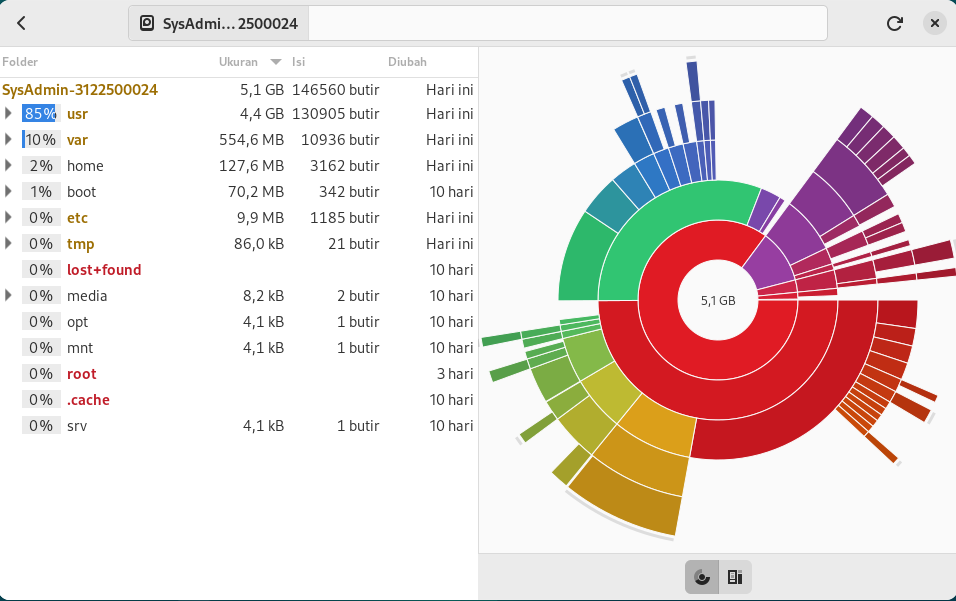

---

## Membersihkan Paket

```apt/aptitude/dpkg``` package manager asli debian. seluruh source/deb dari paket akan di store di ``/var/cache/apt/archives/`` folder.

untuk membersihkan Cache apt kita dapat menggunakan perintah 
```
apt clean
```

setelah di bersihkan cachenya, kita bisa hapus paket yang tidak terpakai dengan perintah

```
apt autoremove --purge
```

---

biasanya jika kita melakukan update versi terbaru OS banyak paket yang obsolete atau usang. kita bisa lakukan check paket apa saja yang obsolete dan menghapusnya dengan perintah

```
apt list '?obsolete'

apt remove '?obsolete'
```

lalu jika ingin menampilkan dan menghapus config file yang masih tersisa lakukan perintah berikut

```markdown
dpkg --list | awk '/^rc/ {print $2}'
apt purge $(dpkg --list | awk '/^rc/ {print $2}' )
```

---

##### Ada Tool Mudah Yaitu _deborphan_

```markdown
# install 
apt install deborphan

# list paket usang
echo $(deborphan)

# menghapus paket usang
apt autoremove --purge $(deborphan)
```

---

### Mengosongkan Keranjang Sampah

Selain menghapus file tidak penting kita juga dapat mengurangi penggunaan ruang disk dengan cara menghapus Sampah secara permanen

ada **3 Jenis**

gunakan terminal
User : ``rm -Rf ~/.local/share/Trash/*``
Administrator : ``rm -Rf /root/.local/share/Trash/*``
External : ``rm -Rf /media/id_user/disk_name/.Trash_1000``

Exeternal user_id adalah login name kita

---
### Membersihkan Cache Aplikasi

walaupun data di cache tidak terlalu besar tetapi dapat mengurangi disk terpakai.

lakukan hapus pada direcotry berikut:
``rm -Rf ~/.cache/*``

terkadang beberapa paket menyimpan cache di tmp yang dimana akan terhapus saat kita logout.

---

### Membersihkan File Thumbnails

sama seperti cache biasanya file jenis ini sizenya kecil. dan saat file sebenarnya dihapus thumbnail terkadang masih tersimpan.

nah kita dapat menghapus pada directory berikut:

```rm -Rf ~/.thumbnails```

Folder akan dibuat kembali oleh system


---

## INSTALASI External paket .deb

terkadang di debian ada beberapa aplikasi yang tidak ada. maka dari itu kita dapat menginstall dari source luar / paket luar dengan .deb format.


> **deb** seperti zip tapi punya debian, beberapa paket manajer seperti APT Synaptic KDE menyediakan file yang dibutuhkan berformat .deb.
---

### Instalasi dengan GDBei
dengan mode grafik kita dapat menginstall external .deb.

```apt update && apt upgrade gdbei```

langkah install: **Klik Kanan Open dengan GDBei atau open dari aplikasi, kemudian klik Install Package, jika ingin menghapus tekan Remove Package**

---

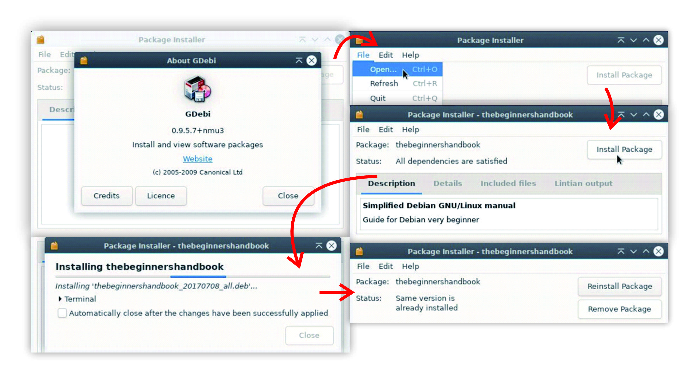

---

### Instalasi dengan Terminal

dpkg adalah utilitas software yang menyimpan paket-paket. jika menggunakan dpkg untuk menginstall paket eksternal, paket dependen dibutuhkan satu persatu dari terminal. 

gunakan perintah. 
```
dpkg -1 package_name.deb
```
untuk menghapus paket eksternal, gunakan 
```
dpkg –purge package_name.
```

---

# INSTALL Flatpak Application

**flatpak** adalah  sistem  virtualisasi aplikasi untuk GNU/Linux. Tujuannya adalah memberikan “sandbox” yang aman, terlindungi dari sistem yang lain.  

format .deb menggunakan dependensi yang umum yang saling terhubung satu sama lain dan memiliki akses ke seluruh sistem.

---

##### How To Install
menginstall dengan perintah, 

```
apt install flatpak
```

##### Menambah Repository 

cara menambahkannya adalah dengan menggunakan perintah. 
```
flatpak remote-add flathub https://flathub.org/repo/flathub flatpakrepo
```
---
##### Config aplikasi __flatpak__ di bawah gnome dengan _Software_

```
apt install gnome-software-ptugin-flatpak
```

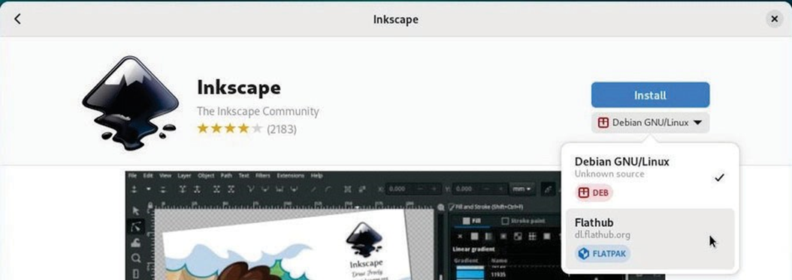

---

##### mengatur aplikasi flatpak di bawah KDE dengan discover

untuk mengatur flatpak seperti aplikasi lainnya, kita harus menginstall plugin yang sesuai. saat mencari, kita harus mengklik file software, jangan langsung mengklik install. Harus melalui repositori flathub dari menu **discover source**.

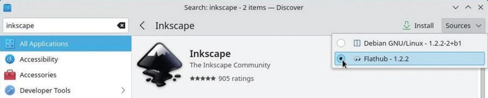

---

##### mengatur aplikasi flatpak dari terminal

| Command | Aksi |
|:----|:---|
|flatpak search flatpak_name| mencari semua flatpak paket di repo|
|flatpak install repository flatpak_name|install flatpak paket dari repo|
|flatpak uninstall flatpak_name|menghapus flatpak paket|
|flatpak uninstall --unused| menghapus dependensi tidak terpakai|
|flatpak update| perbarui semua paket flatpak|
|flatpak run flatpak_name| jalankan paket flatpak|

---

##### menghapus aplikasi flatpak
jika sudah menginstall secara grafik dari software atau discover, cara menghapusnya adalah dengan menu aplikasi dari **software manager**.

```
flatpak uninstall --unused
```

---
#### beberapa repositori flatpak

flathub repositori : 
```
flatpak remote-add flathub https://flathub.orf/repo/flathub/flatpatrepo
```
repositori KDE flatpak : 
```
flatpak remote-add kdeapps https://distribute.kde.org/kdeapps.flatpakrepo
```

repositori gnome-nightly flatpak : 
```
flstpak remote-add gnome-nightly https:// nightly.gnome.org/gnome-nightly.flatpakrepo
```


---

##### Tambahan _beberapa cabang distribusi_

1. **Stable (Bookworm)** adalah distribusi resmi Debian yang diutamakan, mendapatkan pembaruan hanya untuk keamanan dan perbaikan bug.
2. **Oldstable (Bullseye)** adalah versi stabil sebelumnya yang mendapat dukungan tambahan setelah rilis versi stabil baru, terkadang diperpanjang jika ada pemeliharaan yang cukup.
3. **Testing (Trixie)** adalah versi masa depan Stable yang digunakan untuk mempersiapkan rilis stabil berikutnya setelah melewati periode pembekuan perangkat lunak dan pencarian bug.
4. **Unstable (Sid)** adalah versi yang menerima semua versi paket baru, menjadi pusat inovasi namun kurang stabil, sering digunakan oleh para petualang teknologi.
5. **Experimental** adalah tempat di mana versi perangkat lunak alpha atau beta diuji, bukan distribusi Debian yang resmi.

---

# TERIMA KASIH